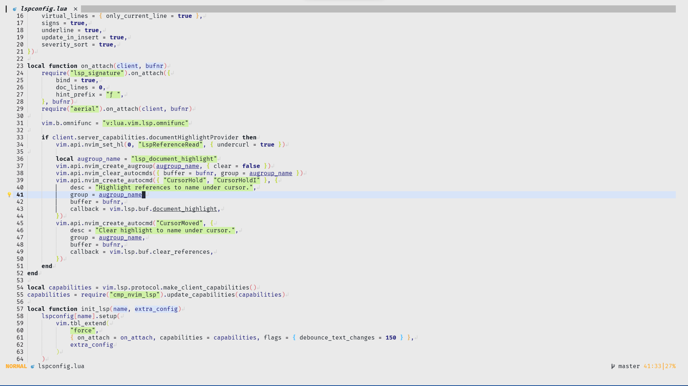
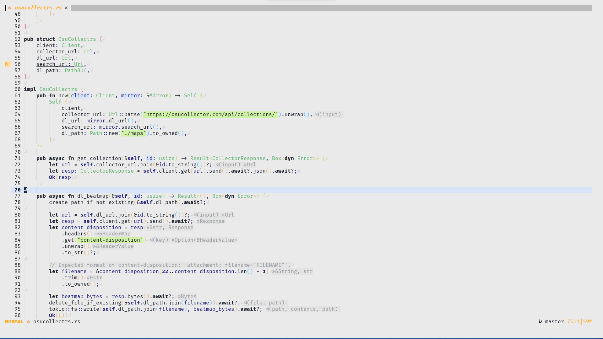

<h1 align="center">☄️ stargaze.nvim</h1>
<p align="center">the colorscheme inspired by a certain comet</p>

This is an experimental color scheme that tries to stay out of the way by
primarily using only black, gray and dark blue, using bold text and backlighting.

## Installation

with [packer.nvim](https://github.com/wbthomason/packer.nvim):
```lua
use({ "hxlcyxn/stargaze.nvim" })

vim.cmd(":colorscheme stargaze")
-- or
require("stargaze").colorscheme()
```

## Screenshots




